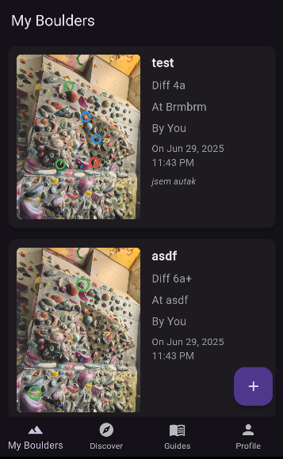

# Boulder App
_name to be come up with_

- Free and Open-Source remake of popular climibing social apps
- Aiming for clean and easy-to-use UI/UX (im a backend dev btw)
- Minimum telemetery (i dont care about you)

### Major Features
- [x] Take photo of a wall, mark-up, name and grade a route
- [x] Browse your locally saved routes
- [x] Register/Login to your account (used only as a authorization for your public boulders)
- [x] Publish your creation to server
- [x] Discover others' creations
- [ ] Location system
- [ ] Save public boulders locally
- [ ] Comment and grade others' boulders

### Minor features
- [x] Dark Mode (should be up there)
- [x] Grading systems - French (Fontaine-Blau), V-Scale, Yosemite

---

### How to contribute

Im thankful for any bug reports, accepting any suggestions and PRs :)

_I have no idea how to make an iOS port_
